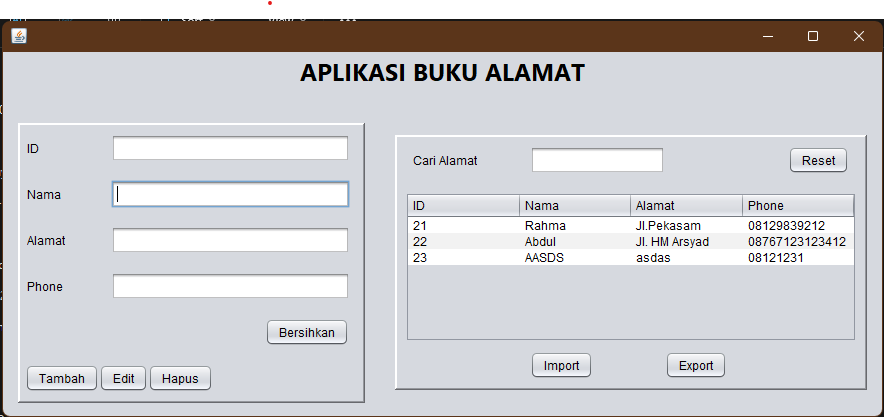

# AplikasiBukuAlamat
 UTS - Rahmatul Maulidyah - 2210010391

Aplikasi Buku Alamat adalah aplikasi manajemen kontak sederhana menggunakan Java Swing dan database untuk menyimpan data kontak seperti nama, alamat, dan nomor telepon.

## Fitur
- **Tambah Data**: Menambahkan data kontak baru ke dalam database.
- **Edit Data**: Mengubah data kontak yang sudah ada.
- **Hapus Data**: Menghapus data kontak dari database.
- **Pencarian Data**: Mencari kontak berdasarkan nama, alamat, atau nomor telepon.
- **Impor Data**: Mengimpor data kontak dari file `addressbook.txt`.
- **Ekspor Data**: Mengekspor data kontak ke file `addressbook.txt`.
- **Reset Tampilan**: Membersihkan field input dan memuat ulang data tabel.

## Struktur Tabel Database
Tabel yang digunakan dalam database memiliki struktur sebagai berikut:

| Kolom   | Tipe Data    |
|---------|--------------|
| `id`    | INTEGER (Primary Key, Auto Increment) |
| `name`  | VARCHAR      |
| `address` | VARCHAR    |
| `phone` | VARCHAR      |

## Cara Menjalankan Aplikasi
1. Pastikan Java Development Kit (JDK) telah terinstal di komputer Anda.
2. Pastikan Anda memiliki database yang terhubung (gunakan `DatabaseConnection.connect()` untuk koneksi).
3. Jalankan file utama aplikasi melalui IDE atau terminal.
4. Pastikan file `addressbook.txt` tersedia untuk fitur impor dan ekspor.

## Cara Menggunakan
### Menambah Data
1. Isi field `Nama`, `Alamat`, dan `Nomor Telepon`.
2. Klik tombol **Tambah**.

### Mengedit Data
1. Pilih data dari tabel dengan mengklik salah satu baris.
2. Perbarui field sesuai kebutuhan.
3. Klik tombol **Ubah**.

### Menghapus Data
1. Pilih data dari tabel dengan mengklik salah satu baris.
2. Klik tombol **Hapus**.

### Pencarian
1. Ketikkan kata kunci pada field pencarian.
2. Hasil pencarian akan muncul secara otomatis.

### Impor Data
1. Pastikan file `addressbook.txt` berisi data dengan format yang benar.
2. Klik tombol **Impor** untuk menambahkan data dari file ke dalam database.

### Ekspor Data
1. Klik tombol **Ekspor** untuk menyimpan data dari database ke file `addressbook.txt`.

### Reset Tampilan
1. Klik tombol **Reset** untuk membersihkan field pencarian dan memuat ulang data tabel.

## Dependencies
- **Java JDK** (minimal versi 8)
- **Database JDBC Driver** (misalnya, untuk MySQL atau SQLite)
- **Swing** untuk antarmuka pengguna.

## Tampilan Antarmuka
Berikut adalah tampilan antarmuka aplikasi:

## Catatan
- Pastikan koneksi database telah diatur dengan benar di `DatabaseConnection.connect()`.
- Format data impor/ekspor harus sesuai dengan struktur tabel database.

## Lisensi
Aplikasi ini dirilis di bawah lisensi MIT. Silakan gunakan dan modifikasi sesuai kebutuhan Anda.

